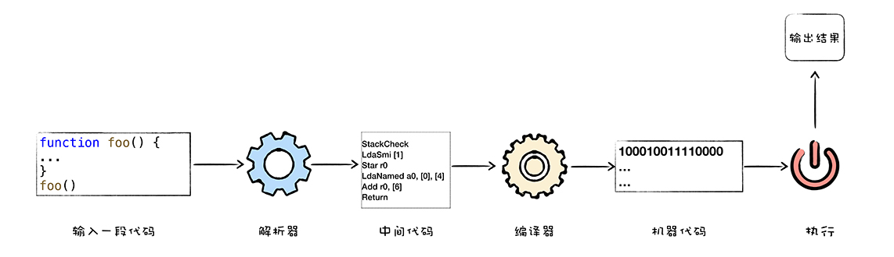

# google V8

# 1-1
- V8 is Google’s open source high-performance JavaScript and WebAssembly engine, written in C++
- V8 率先引入了即时编译（`JIT`）的双轮驱动的设计，这是一种权衡策略，混合编译执行和解释执行这两种手段，给 JavaScript 的执行速度带来了极大的提升 
- V8 也是早于其他虚拟机引入了`惰性编译`、`内联缓存`、`隐藏类`等机制，进一步优化了 JavaScript 代码的编译执行效率
- 比如初期的 JavaScript `没有块级作用域`机制，使得 JavaScript 需要采取`变量提升`的策略
- `隐藏类（Hide Class）`，这是将 JavaScript 中`动态类型`转换为`静态类型`的一种技术，可以消除动态类型的语言执行速度过慢的问题，如果你熟悉 V8 的工作机制，在你编写 JavaScript 时，就能充分利用好隐藏类这种强大的优化特性，写出更加高效的代码。
- `事件循环系统`和`垃圾回收机制`

# 1-2 V8是如何执行一段JavaScript代码的？

- 可以把 V8 看成是一个`虚构出来的计算机`，也称为`虚拟机`，虚拟机通过`模拟实际计算机`的各种功能来实现代码的执行，如模拟实际计算机的 CPU、堆栈、寄存器等，虚拟机还具有它自己的一套`指令系统`, 不需要担心现实中`不同操作系统`跟`不同体系结构计算机`的差异
- `不同的 CPU 有着不同的指令集`，如果要使用机器语言或者汇编语言来实现一个功能，那么你需要为每种架构的 CPU 编写特定的汇编代码
- 编写`汇编代码`时，我们还需要`了解和处理器架构相关的硬件知识`，比如你需要使用寄存器、内存、操作 CPU 等。大部分程序员在编写应用的时候，只想专心处理业务逻辑，并不想要过多地理会这些处理器架构相关的细节。
- 因此我们需要一种屏蔽了计算机架构细节的语言，能适应多种不同 CPU 架构的语言，能专心处理业务逻辑的语言，诸如 C、C++、Java、C#、Python、JavaScript 等，这些“高级语言”就应运而生了
- 

解释执行
  

編譯执行 => js, java需要v8或是jvm等虛擬機去編譯
  

- V8采用`混合编译执行`和`解释执行`这两种手段，我们把这种技术称为`JIT（Just In Time）`技术
- 